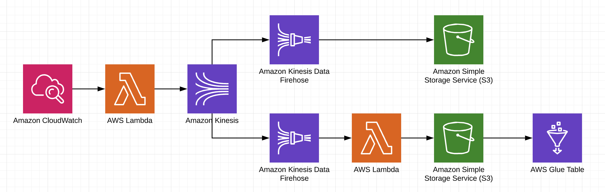

# AWS_Terraform_Streaming

This is a very simple project I have made in order to get myself more familiar with both data streaming processes, terraform and working with the AWS platform as a whole.  
A lambda function that requests data from [punkapi's](https://punkapi.com/documentation/v2) ``random`` endpoint: ```https://api.punkapi.com/v2/beers/random``` into a kinesis source stream is  periodically invoked by  a cloudwatch event rule. 
The data is then delivered to two kinesis firehose services, one to save the raw data into an s3 bucket, and another that invokes a lambda to transform the data before saving it to another s3 bucket, which is mapped to  a glue data catalog table:


